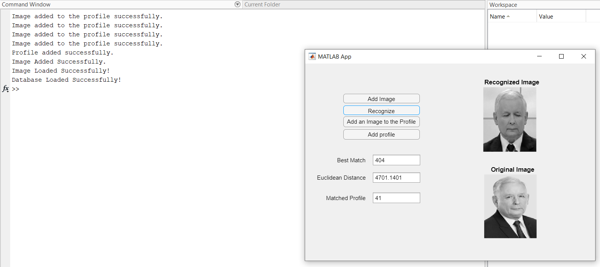

# Face Recognition System in Matlab

## About

This project was made as an assignment for Matlab inteoductory course, therefore it will not longer be supported. The whole project was made on and for Windows, but may work well on other systems too.

## Example

## Dataset Source

The one I used comes from AT&T, you can download it from here:

https://www.kaggle.com/kasikrit/att-database-of-faces/download

Extract this file and rename it to "dataset", move it to the project root file (where all .m files reside). Make sure all contents of dataset are folders named "sA" where A is the next natural number. Contents of each "sA" file ought to be "B.pgm" files, where B is the next natural number (for each image).

## Using the Application

To use the application, run app.mlapp.

To add perform recognition, you must add an image - select Add Image button and select the image you fancy. Then push the button labeled Recognize and wait for the results.

To add a new profile, select Add an Image to the Profile button and insert any image you want. To add more images just do as previously - select  Add an Image to the Profile. You can add as many images as you want, but they will become less relevant to the program, the more images you provide. Finally, select Add Profile button and voila - you've created a new profile.

Remember: all images you input must be with .jpg extension.

## Dependencies

Statistics and Machine Learning Toolbox

## Functions Description

### App entry - app

### Button Handlers

add_image() - adds an image to directory 'profile' in the root file. It's purpose is to keep a single image for recognition. Each newly added image replaces the existing one.

face_recognition() - performs face recognition of a previously added image.

add_image_to_the_profile() - adds a single image to temporary profile. Each image is named accordingly to it's number in the directory (as count of files +1).

add_profile() - adds a profile to the dataset, so it's all images become relevant in calculating the eigenfaces.

### Helper functions

load_user_img() - provides an image added through the add_image() function in a formatted way to the face_recognition() function, as the tested image.

load_data() - provides a set of images from the dataset folder to the face_recognition() function, as training set.
